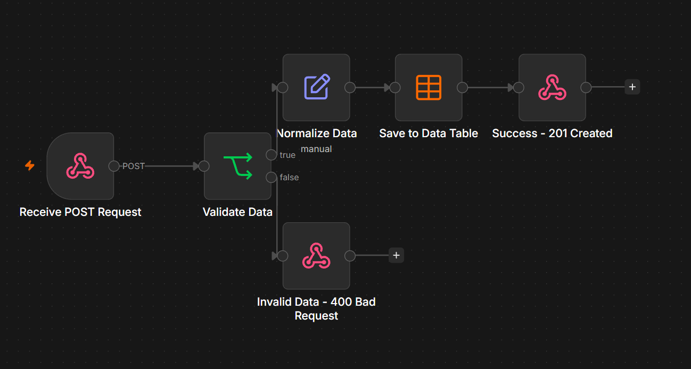
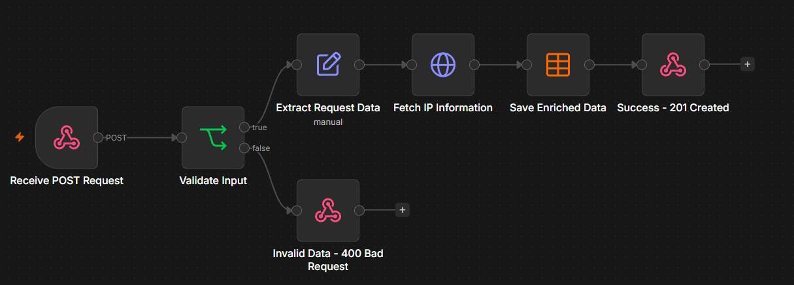

# ⚙️ Automation Lab

A growing collection of hands-on projects focused on **automation, APIs, backend development, and AI**.

The goal of this repository is simple: learn by building real workflows, understand how they work, document what I learn, and gradually increase the complexity.

> Build → Break → Understand → Document → Repeat.

---

## 🧪 Projects

### 01 — Webhook Receiver

A complete webhook processing flow built with **n8n**.

The workflow receives a `POST` request, validates incoming data, normalizes it, stores valid records in an n8n Data Table, and returns the appropriate HTTP response.



#### Flow

```text
POST Request
     ↓
Validation
   ↙     ↘
TRUE    FALSE
 ↓        ↓
Normalize   400 Bad Request
 ↓
Data Table
 ↓
201 Created
```

#### What it covers

* HTTP POST requests
* Webhooks
* JSON request body
* Input validation
* Regex
* Data normalization with `trim()`
* TRUE / FALSE branching
* Data mapping
* n8n Data Tables
* HTTP response codes
* `201 Created`
* `400 Bad Request`
* API testing with Postman
* Cloudflare Tunnel

📁 [`01-webhook-receiver`](./01-webhook-receiver/)

---

### 02 — API Data Fetcher

A webhook-based data enrichment workflow built with **n8n**.

The workflow receives a `POST` request, validates the incoming data, extracts the client's IP address from Cloudflare request headers, fetches additional IP information from an external REST API, stores the enriched record in an n8n Data Table, and returns the appropriate HTTP response.



#### Flow

```text
POST Request
     ↓
Validation
   ↙      ↘
TRUE     FALSE
 ↓         ↓
Extract    400 Bad Request
 ↓
External API
 ↓
Data Enrichment
 ↓
Data Table
 ↓
201 Created
```

#### What it covers

* External REST API requests
* n8n HTTP Request node
* Dynamic API URLs
* n8n expressions
* Client IP extraction
* Cloudflare request headers
* IPv4 / IPv6 handling
* Input validation with `trim()` and regex
* Data enrichment
* Combining data from multiple workflow stages
* n8n Data Tables
* HTTP response codes
* External API error handling
* Test webhook troubleshooting

The workflow uses **ipwho.is** to enrich the original request with information such as:

`IP` · `IP type` · `Continent` · `Country` · `Region`

📁 [`02-api-data-fetcher`](./02-api-data-fetcher/)

---

## 🛠️ Technologies

`n8n` · `REST API` · `HTTP` · `JSON` · `Webhooks` · `Postman` · `Cloudflare Tunnel` · `ipwho.is`

More technologies will be added as the projects become more complex.

Planned areas include:

`Docker` · `PostgreSQL` · `External APIs` · `Telegram` · `Discord` · `LLMs` · `RAG` · `Vector Databases` · `AI Agents` · `Orchestration`

---

## 📚 Detailed Learning Notes

Each project is documented in much more detail in **Daydreaming Workspace**, my public Discord knowledge base.

It contains:

* explanations of individual workflow components;
* screenshots and configuration examples;
* concepts learned while building;
* mistakes, debugging, and troubleshooting;
* quick navigation for every project;
* practical notes that grow together with the repository.

> **Language:** The Discord server and learning notes are primarily in **Russian**.

**[Join Daydreaming Workspace →](https://discord.gg/Mxy9y8uMFJ)**

---

## 🎯 Goal

This repository is not intended to be a collection of copied tutorials.

Each project is built as a practical exercise to improve my understanding of:

**Automation · Backend · APIs · Data Processing · AI**

The projects gradually increase in complexity — from basic webhooks and API integrations to databases, backend services, AI workflows, RAG, agents, orchestration, and more advanced automation systems.

The long-term goal is to turn the knowledge gained here into larger, production-oriented software and automation products.

---

## 📈 Progress

* [x] `01` — Webhook Receiver
* [x] `02` — API Data Fetcher
* [ ] `03` — Coming next...

---

> **02 / 50 — Automation Lab**
