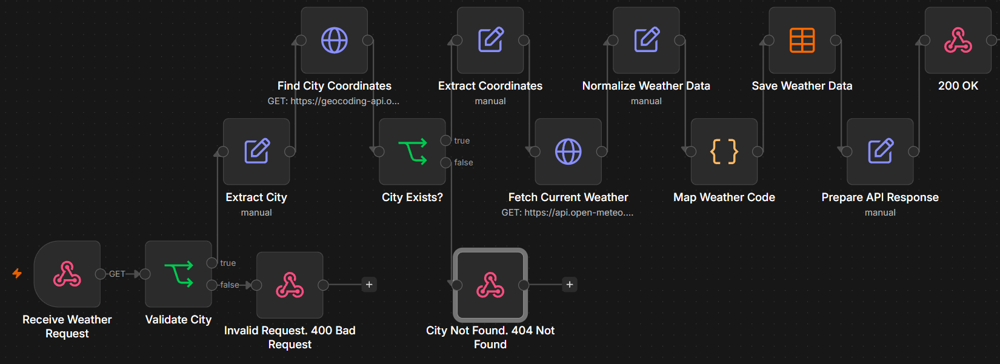

# Automation Lab

A collection of small n8n automation projects built to practice workflow automation, APIs, data processing, validation, storage, and backend logic.

The projects gradually increase in complexity. Each workflow focuses on a specific set of concepts and is documented with a preview and an exported n8n workflow.

---

## Projects

### 01 - Webhook Receiver

A basic webhook workflow that receives POST requests, validates incoming data, normalizes it, stores it in an n8n Data Table, and returns the appropriate HTTP response.

**What it covers:**
- Webhook triggers
- POST requests
- JSON request bodies
- Input validation
- Regular expressions
- Data normalization
- Edit Fields
- Data Tables
- HTTP responses
- 201 Created / 400 Bad Request

**Flow:**

`POST Request -> Validate Data -> Normalize Data -> Save to Data Table -> HTTP Response`


---

### 02 - API Data Fetcher

A workflow that receives user data through a webhook, validates the request, extracts the client's IP address, fetches additional IP information from an external API, combines data from multiple workflow stages, stores the enriched result, and returns an HTTP response.

**What it covers:**
- Webhook triggers
- POST requests
- Input validation
- Data extraction
- External API requests
- HTTP Request node
- Dynamic expressions
- Data enrichment
- Combining data from different nodes
- Data Tables
- 201 Created / 400 Bad Request

**Flow:**

`POST Request -> Validate Input -> Extract Request Data -> Fetch IP Information -> Save Enriched Data -> HTTP Response`


---

### 03 - Weather API Service

A dynamic weather API workflow that receives a city through a GET query parameter, resolves the city to coordinates, fetches current weather data, normalizes the result, maps weather codes to readable descriptions, stores the weather data, and returns a clean API response.

The workflow also distinguishes between invalid requests and valid requests for cities that cannot be found.

**What it covers:**
- GET requests
- Query parameters
- Input validation
- Geocoding API integration
- API chaining
- Passing data between external APIs
- Nested JSON structures
- Array access with `results[0]`
- Resource existence validation
- Dynamic expressions
- Weather API integration
- Data normalization
- JavaScript Code node
- WMO weather code mapping
- Data Tables
- Public API response shaping
- 200 OK
- 400 Bad Request
- 404 Not Found

**Flow:**

`GET Request -> Validate City -> Extract City -> Find City Coordinates -> Validate Result -> Extract Coordinates -> Fetch Current Weather -> Normalize Weather Data -> Map Weather Code -> Save Weather Data -> Prepare API Response -> 200 OK`

Error paths:

`Invalid Request -> 400 Bad Request`

`City Not Found -> 404 Not Found`



---

## Project Structure

```text
automation-lab/
│
├── 01-webhook-receiver/
│   ├── 01_preview.png
│   └── workflow.json
│
├── 02-api-data-fetcher/
│   ├── 02_preview.png
│   └── workflow.json
│
├── 03-weather-api-service/
│   ├── 03_preview.png
│   └── workflow.json
│
└── README.md
```

Each project contains:

- `workflow.json` - exported n8n workflow
- `XX_preview.png` - visual preview of the workflow

Detailed learning notes and troubleshooting documentation are maintained separately in my Discord workspace.

---

## Learning Progress

### 01 - Webhook Receiver

Started with the fundamentals of building an API-style workflow in n8n:

`Webhook -> Validation -> Normalization -> Storage -> Response`

### 02 - API Data Fetcher

Extended the workflow with an external API and data enrichment:

`Webhook -> Validation -> Data Extraction -> External API -> Enriched Storage -> Response`

### 03 - Weather API Service

Built a dynamic API service using multiple external API calls and additional backend logic:

`GET Query -> Validation -> Geocoding API -> Result Validation -> Weather API -> Normalization -> JavaScript Mapping -> Storage -> Public Response`

This project introduced API chaining, nested response processing, resource validation, JavaScript transformations, and separation between internal stored data and the public API response.

---

## Tech

- n8n
- JavaScript
- REST APIs
- Webhooks
- JSON
- HTTP
- Regular Expressions
- n8n Data Tables
- Open-Meteo APIs
- Postman
- Docker
- Cloudflare Tunnel

---

## Goal

The goal of this repository is to build practical automation experience through small projects instead of only studying individual n8n nodes.

Each new workflow introduces additional concepts while reusing knowledge from previous projects.

The long-term goal is to progress from basic workflows to more advanced automation systems involving multiple APIs, databases, AI agents, queues, orchestration, monitoring, and production-style error handling.
